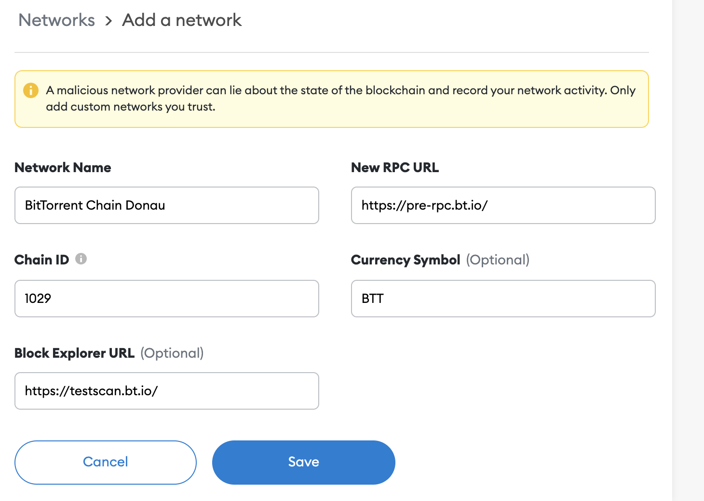
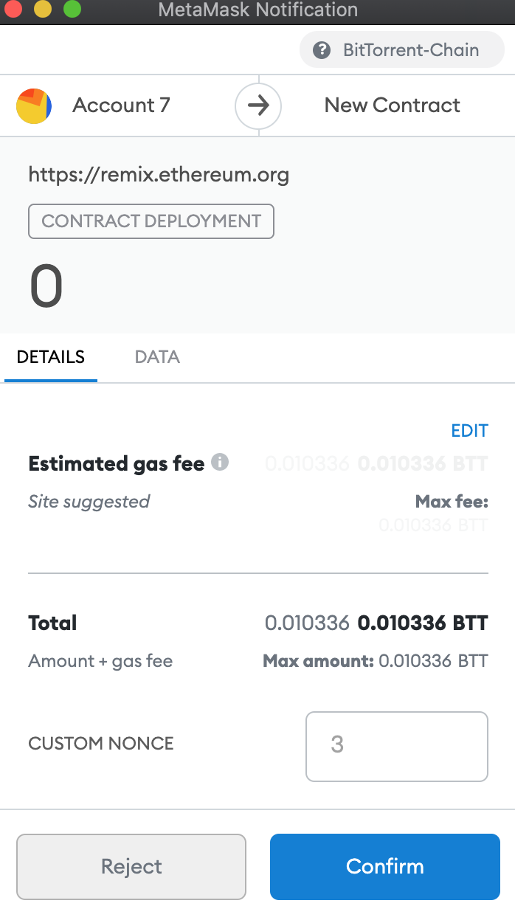

# Deploy Contract with Remix
This article is a beginning with the deployment of the simplest Hello World contract.

## Setting up Remix IDE
[Remix](https://remix.ethereum.org/) is a web-based IDE for writing, compiling, and deploying smart contracts.

If this is your first time using Remix, you must locate and activate the "Solidity compiler" plug-in, as shown in the figure below.


By clicking the button circled in the figure, you can create a new file called HelloWorld.sol and copy and paste the following code into it.


## HelloWorld.sol
This is the smart contract code we are going to deploy:

```python
//SPDX-License-Identifier: GPL-3.0
pragma solidity ^0.8.7;

contract HelloWorld {
    string public greeting;
    
    constructor(string memory message) {
        greeting = message;
    }
    
    function updateGreeting(string memory message) public {
        greeting = message;
    }
}
```
In the first line, `SPDX-License-Identifier: GPL-3.0` specifies that this smart contract is open source and adheres to the `GPL3.0` open source agreement. You can also choose from a variety of other open-source licenses based on your specific requirements. When there is not a license, use `UNLICENSED`.

The second line, `pragma solidity ^0.8.7`, specifies the compiler's version. This contract can be successfully compiled only with the Solidity compiler version 0.8.7 or higher.

`string public greeting` declares a public variable named greeting of the string type. This variable is referred to as a state variable, and it will be stored in the contract and on the blockchain in perpetuity. The public keyword enables external access to this variable and creates an accessor function for it.

`constructor` specifies the contract's constructor. It is capable of receiving a string parameter message, storing it in memory, and assigning the message's value to `greeting`. Please keep in mind that each smart contract can only contain one constructor, which will be invoked only when the contract is deployed.

`function updateGreeting` declares an ordinary function that can be called from outside to modify the content of greeting.
## Compile Smart Contract

Select the Solidity compiler on the left, and select version 0.8.7 or higher.

Click Compile HelloWorld.sol. When the compilation is successful, the compiler icon will have a green tick, as shown in the figure.


## Network settings

Open the MetaMask wallet and select Custom RPC in the drop-down menu as shown in the figure


Fill in according to the information in the picture:

- Network Name: BitTorrent Chain Donau
- RPC URL: https://pre-rpc.bt.io/
- ChainID: 1029
- Symbol: BTT
- Block Explorer URL: https://testscan.bt.io/





Kindly visit the faucet to obtain some test BTT.

Once the network configuration is complete, the smart contract can be deployed on BTTC.


## Deployment contracts

First, in the DEPLOY & RUN TRANSACTIONS column of Remix, select Injected Web3 from the Environment drop-down menu


In the input box next to Deploy, enter the initial Greeting content


After clicking Deploy, MetaMask will pop up a transaction confirmation window



Congratulations! The HelloWorld contract has been successfully deployed to the BTTC testnet. Now you can interact with it and check its status on the explorer.

