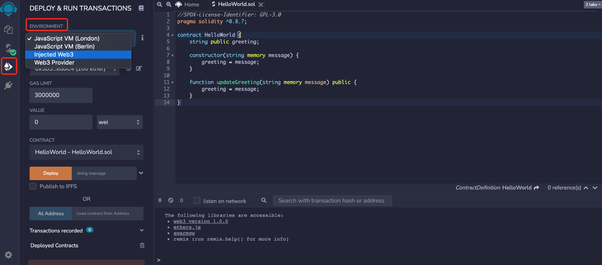

# 使用Remix在BTTC上部署合约
本文介绍如何使用Remix在BTTC测试网上部署一个简单的HelloWorld智能合约。

## 设置Remix
Remix是一个在线的智能合约IDE，可以用与编写、编译以及部署合约。

如果这是您首次使用Remix，需要在插件一栏中，找到“Solidity compiler”，并激活它，如下图


点击图中圈出的按钮，创建一个新文件，命名为HelloWorld.sol，并将下面的代码复制粘贴到这个文件中。


## HelloWorld.sol
下面是HelloWorld智能合约的代码：
```python 
//SPDX-License-Identifier: GPL-3.0
pragma solidity ^0.8.7;

contract HelloWorld {
    string public greeting;
    
    constructor(string memory message) {
        greeting = message;
    }
    
    function updateGreeting(string memory message) public {
        greeting = message;
    }
}
```

第一行的`//SPDX-License-Identifier: GPL-3.0`表示这个智能合约是开源的，并且使用了GPL3.0的开源协议，可以根据需求自行选择其他开源协议。无协议时使用UNLICENSED。

第二行`pragma solidity ^0.8.7` 声明了编译器的版本。这个合约只能在0.8.7以及更高版本的Solidity编译器中才能编译成功。

`string public greeting`声明了一个名为`greeting`的字符串类型的public变量，这种变量称为state variable，会被永久保存在合约中以及区块链上。public关键字让这个变量可以从合约外部被访问，并为其创建一个accessor函数。

`constructor`声明了这个合约的构造函数。它可以接收一个string类型的参数message，将其存储在内存中，并将其值赋给greeting。请注意，每个智能合约中只能有一个构造函数，它仅会在部署合约时被调用。

`function updateGreeting`声明了一个普通函数，可以从外部调用，来修改greeting的内容。

## 编译合约

在左侧选择Solidity编译器，并选择0.8.7或者更高的版本。

点击Compile HelloWorld.sol。编译成功时，编译器图标会有绿色的对勾，如图所示。


## 网络设置

打开MetaMask钱包，并在如图的下拉选单中选择Custom RPC


按照图中的信息填写：

* 网络名称（Network Name）：BitTorrent Chain Donau
* RPC URL（RPC URL）：https://pre-rpc.bt.io/ 
* 智能链ID（ChainID）：1029
* 符号（Symbol）：BTT
* 区块浏览器URL（Block Explorer URL）：https://testscan.bt.io/


请前往水龙头来获取测试BTT。完成了网络设置，接下来，就能在BTTC上部署智能合约了。

## 部署合约

首先，在Remix的DEPLOY & RUN TRANSACTIONS栏中，从Environment的下拉菜单里选择Injected Web3



在Deploy旁边的输入框中，输入初始的Greeting内容


点击Deploy后，MetaMask会弹出交易确认的窗口


恭喜，HelloWorld合约已经成功部署到了BTTC的测试网，现在您可以与它进行交互了，同时可以再浏览器上检查它的状态。

