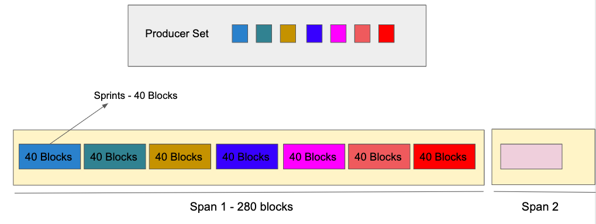

# 提议者和区块生产者竞选
Bttc层中区块生产者是根据他们的质押占比从验证者集合中每隔一段时间选举
出来。验证者的股权比例确定了被选中的概率。

## 竞选流程
假设我们有3个验证人在验证者集合中--验证人A、验证人B和验证人C
* 验证人A质押100个BTT代币
* 验证人B质押40个BTT代币
* 验证人C质押40个BTT代币

验证人根据质押的大小获得相应的槽位。

因为验证人A有100个BTT代币的质押，而每个槽位的成本是20个BTT代币，所以验证人A总共得到5个槽位，验证人B和验证人C总共得到2个槽位。

验证人A、验证人B和验证人C得到了以下的槽位：
* [ A, A, A, A, A, B, B, C, C ]

然后，BTTC使用TRON网络区块哈希值作为随机种子，对验证人A、验证人B和验证人C的插槽进行随机组合。

随机组合的结果如下：
* [ A, B, A, A, C, B, A, A, C ]

现在，根据区块生产者总数，BTTC使用从头到尾的顺序选择区块生产者--例如，对于一个有5个生产者的集合，槽位的组合是[ A, B, A, A, C]。

下一个跨度的区块生产者集被定义为[ A：3，B：1，C：1 ]。

使用这种算法，BTTC 为 Bttc 层上的每个 `sprint` 选择一个生产者。`sprint` 是一个验证人连续生产的区块数。

